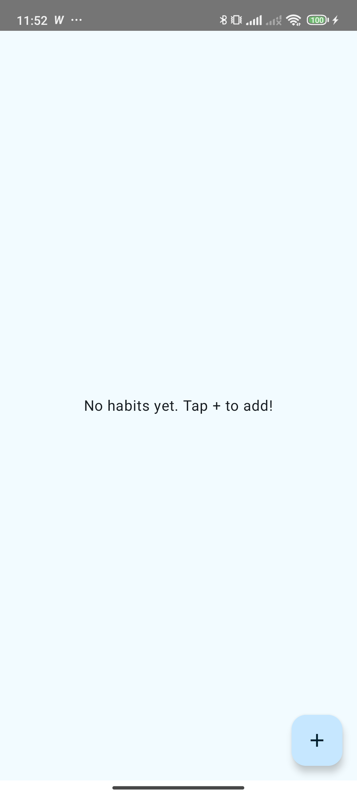
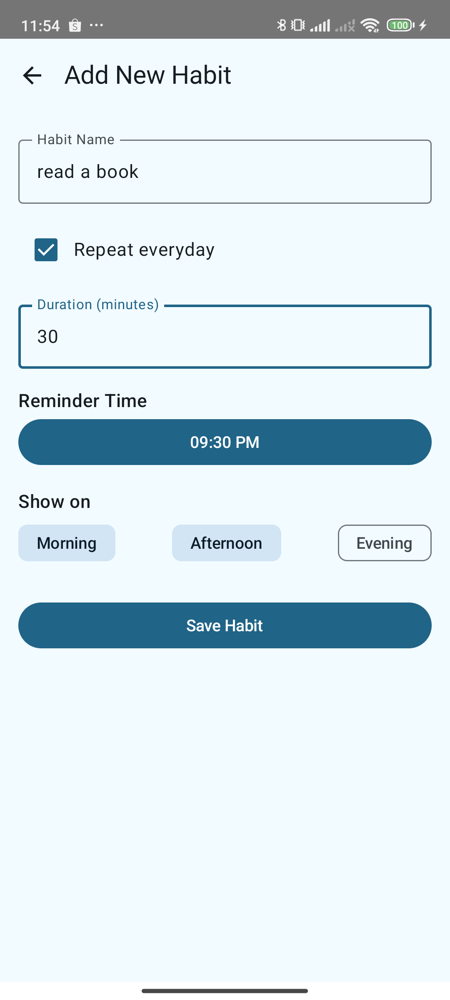
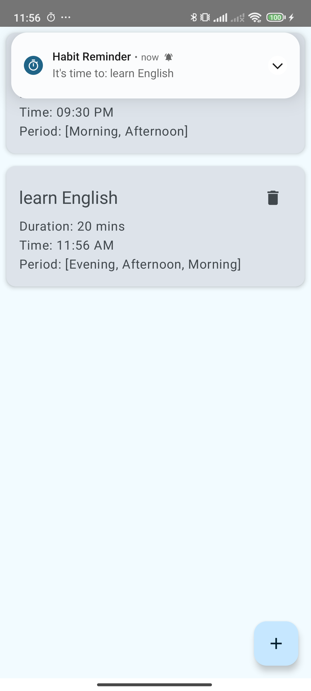

# Habit Tracker App

## Giới thiệu

Ứng dụng **Daily Habit Tracker** giúp bạn xây dựng và duy trì thói quen hàng ngày một cách hiệu quả.
Với giao diện trực quan và tính năng nhắc nhở thông minh, bạn dễ dàng theo dõi tiến độ và đạt được
mục tiêu cá nhân.

    
    
    

## Tính năng

- 🎯 **Tạo thói quen mới** với tên, thời lượng, thời gian nhắc nhở và buổi áp dụng.
- ⏰ **Nhắc nhở tự động** qua thông báo khi đến giờ đã đặt.
- 🗑️ **Xóa thói quen** không cần thiết.

## Công nghệ sử dụng

- **UI**: Jetpack Compose, Material Design 3.
- **Architecture**: Clean Architecture, MVVM.
- **Local Database**: Room Database.
- **Dependency Injection**: Hilt.
- **Background Tasks**: WorkManager (để lên lịch nhắc nhở).
- **Navigation**: Navigation Component.